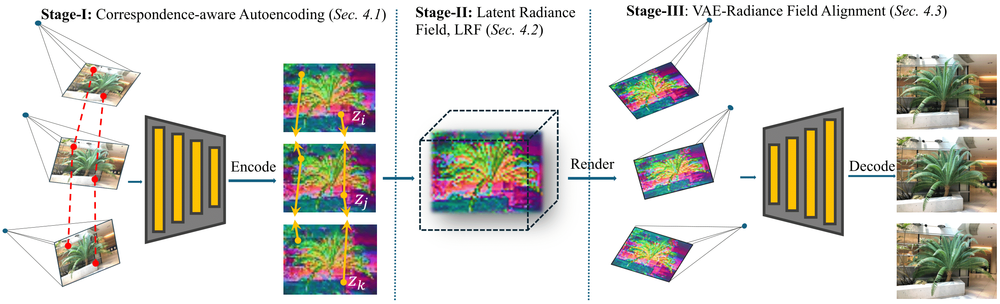

# [ICLR 2025] Latent Radiance Fields with 3D-aware 2D Representations

<h4 align="center">

Latent Radiance Fields with 3D-aware 2D Representations

[Chaoyi Zhou*](https://chaoyizh.github.io/chaoyizh-home-page/), [Xi Liu*](https://xiliu8006.github.io/), [Feng Luo](https://people.computing.clemson.edu/~luofeng/), [Siyu Huang](https://siyuhuang.github.io/)

[](https://arxiv.org/abs/2502.09613)
[](https://latent-radiance-field.github.io/LRF/)
[](https://huggingface.co/chaoyizh/LRF)


</h4>
<p>
    
</p>

This repository contains the official implementation of the paper: [Latent Radiance Fields with 3D-aware 2D Representations](https://arxiv.org/abs/2502.09613), which was accepted to ICLR 2025.
we propose a method to achieve 3D-aware 2D representations and enable **3D reconstruction in the latent space**. We present a three-stage pipeline to enhance the 3D awareness of both encoder and decoder of the VAE

Feel free to contact me, [Chaoyi Zhou](https://chaoyizh.github.io/chaoyizh-home-page/) or open an issue if you have any questions or suggestions.


## 📢 News
- **2025-02-14**: Training, rendering, and evalution codes are released!
- **2025-01-22**: Latent Radiance Fields with 3D-aware 2D Representations is accepted to ICLR 2025.


## 📋 TODO

- [x] Release the code for Latent Radiance Fields.
- [ ] Release the code for 3D-aware fine-tuning.


## 🔧 Installation

```bash
git clone https://github.com/ChaoyiZh/latent-radiance-field.git
cd latent-radiance-field
conda create --name lrf python=3.8
conda activate lrf
```
PyTorch (Please check your CUDA version, we used 11.8)
```bash
pip install torch==2.4.0 torchvision==0.19.0 torchaudio==2.4.0 --index-url https://download.pytorch.org/whl/cu118
```
Required packages
```bash
pip install -r requirements.txt
```

## 🦾 LRF training, rendering, and evaluation
### Dataset
We follow the same dataset logistics for [3D Gaussian Splatting](https://github.com/graphdeco-inria/gaussian-splatting). COLMAP loaders expect the following dataset structure in the source path location:
```bash
<location>
|---images
|   |---<image 0>
|   |---<image 1>
|   |---...
|---images_2
|   |---...
|---images_4
|   |---...
|---images_8
|   |---...
|---sparse
    |---0
        |---cameras.bin
        |---images.bin
        |---points3D.bin
```
For the dataset we used in our paper. Please refer to [MipNeRF 360](https://jonbarron.info/mipnerf360/),[DL3DV-10K](https://dl3dv-10k.github.io/DL3DV-10K/), [NeRF-LLFF](https://www.kaggle.com/datasets/arenagrenade/llff-dataset-full/data), and [MVImgNet](https://github.com/GAP-LAB-CUHK-SZ/MVImgNet).

### Training
```bash
cd gaussian-splatting
python train.py -s data/DATASET_NAME -m output/OUTPUT_NAME -i images_8 --ae_model VAE --ckpt_path path/to/ckpt --cfg_path config/config.yaml --eval --convert_SHs_python
```
### Rendering
```bash
python render.py -s data/DATASET_NAME -m output/OUTPUT_NAME --convert_SHs_python --full_render
```
### Evluataion
```bash
python metrics.py -s data/DATASET_NAME -m output/OUTPUT_NAME
```
## 📚 Citation
If you find our work helpful, please consider citing:
```bibtex
@inproceedings{zhou2025lrf,
  title={Latent Radiance Fields with 3D-Aware 2D Representations},
  author={Zhou, Chaoyi and Liu, Xi and Luo, Feng and Huang, Siyu},
  booktitle={International Conference on Learning Representations (ICLR)},
  year={2025}
}
```


